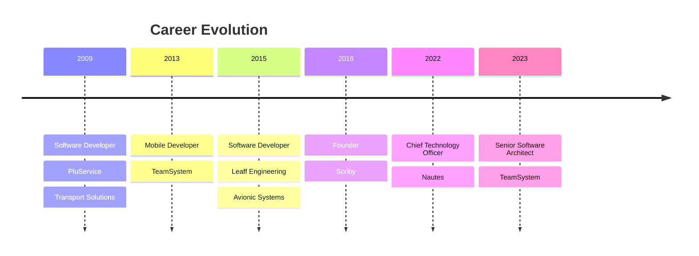

# Alessandro F. Annini

## 👋 Hey there! 

I'm a Senior Software Architect at TeamSystem with a passion for emerging technologies and continuous learning. Currently exploring the fascinating world of **AI** and pushing the boundaries of what's possible with modern technology!

### 🚀 Quick Highlights

- 🎯 Senior Software Architect crafting scalable solutions
- 🤖 AI enthusiast working with OpenAI, LangChain, and DSPy
- ☁️ Cloud architecture expert with AWS
- 🛠️ Full-stack developer with expertise in modern web technologies
- 📱 Mobile development veteran (React Native & Native)
- 🎓 Lifelong learner always exploring new technologies
- 🌍 Based in Falconara Marittima, Italy 🇮🇹

## 🛠️ Tech Stack

| AI & Cloud | Frontend | Backend | DevOps |
|------------|----------|----------|---------|
|  |  |  |  |
|  |  |  |  |
|  |  |  |  |

## 🎯 Professional Journey

## ✍️ Latest Publications

1. **[AWS Resource Start and Stop Scheduling for RDS, EKS and EC2](https://alessandro-annini.medium.com/aws-resource-start-and-stop-scheduling-for-rds-eks-and-ec2-de8b6852c8e3)** (2024)
   *Save money and reduce your carbon footprint by streamlining your database management effortlessly!*

2. **[Lightning-Fast Development with Zed and Dev Containers](https://alessandro-annini.medium.com/lightning-fast-development-with-zed-and-dev-containers-11df1135b635)** (2024)
   *T Minus 2 Minutes to Use Dev Containers with Zed*

3. **[What's my AGI again?](https://alessandro-annini.medium.com/whats-my-agi-again-implementing-an-autonomous-agent-in-js-e05d73cf532c)** (2023)
   *Building an Autonomous Agent with OpenAI*

## 🏆 Key Projects

1. **Scriby** - Cloud-based electronic invoicing platform
   - Simplified Italian electronic invoicing for SMEs
   - Complete business document management solution

2. **Helicopter Entertainment System**
   - Cross-platform in-flight entertainment for Bell helicopters
   - Featured in [Bell 525 Relentless](http://www.bellhelicopter.com/news/press-release/2016/9/525-magnificent-interior)

3. **MyCicero**
   - Multi-modal transportation payment system
   - Integrated parking, train, bus, and metro payments
   - NFC validation system for public transport

## 🎸 Beyond Code

- 🎵 Passionate musician (Guitar & Vocals)
- 🚑 Former Emergency Driver (1998-2006)
- 🌏 Solo traveler (Australia & San Francisco adventures)
- 📚 Continuous learner through online courses
- 🍿 Tech enthusiast with a love for popcorn-fueled learning nights

## 💡 Philosophy

> "I really care about my evolution as architect and developer - I regularly invest in detailed courses about new technologies, whether for work or pure curiosity. When I feel I'm missing something or I'm just curious about the latest trends, I go shopping for courses online and prepare popcorn for the night."

---

---

Last updated: November 2024

